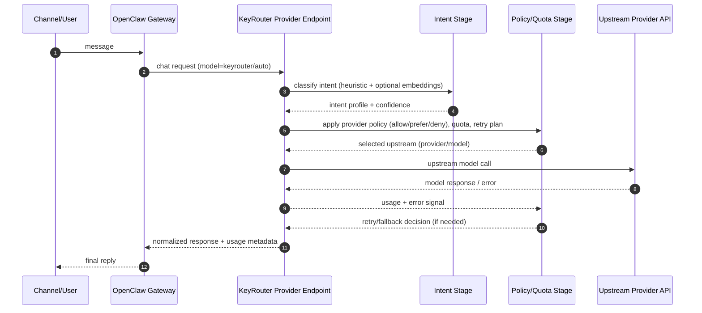

# KeyRouter (Golden Source)

BYOK-first model router plugin for OpenClaw.

## Direction

We are moving from hook-based routing to a provider-endpoint architecture:

- OpenClaw selects `keyrouter/auto` as the configured model.
- KeyRouter is registered as a provider in OpenClaw config.
- Requests are sent to KeyRouter's local endpoint (plugin-owned).
- KeyRouter performs intent + policy routing and calls the real upstream model/provider.
- Responses are normalized back to OpenClaw.

This forces all traffic through KeyRouter routing decisions by design.

## Target Config Pattern

```json
{
  "models": {
    "providers": {
      "keyrouter": {
        "baseUrl": "http://127.0.0.1:8410/v1",
        "api": "openai-completions",
        "apiKey": "keyrouter-local",
        "models": [
          { "id": "auto", "name": "KeyRouter Auto", "input": ["text", "image"] }
        ]
      }
    }
  },
  "agents": {
    "defaults": {
      "model": "keyrouter/auto"
    }
  }
}
```

## Request Sequence



## Current State

- `keyrouter` CLI commands exist (`audit`, `route`, `retry`, `usage`, `quota`).
- Hook-based route suggestions exist.
- Hard-apply pinning exists but is brittle against session-level runtime behavior.

## Next Implementation Focus

1. Register `keyrouter` as a real provider with local endpoint.
2. Implement endpoint handlers for OpenAI-compatible request/response paths.
3. Route internally using intent + policy + quota/retry/fallback.
4. Track usage/quota per upstream provider/model.
5. Keep hook mode as fallback only (feature-flagged).

## Notes

- Golden-source repo: `~/code/openclaw-plugin-keyrouter`
- GitHub: <https://github.com/likesjx/openclaw-plugin-keyrouter>
